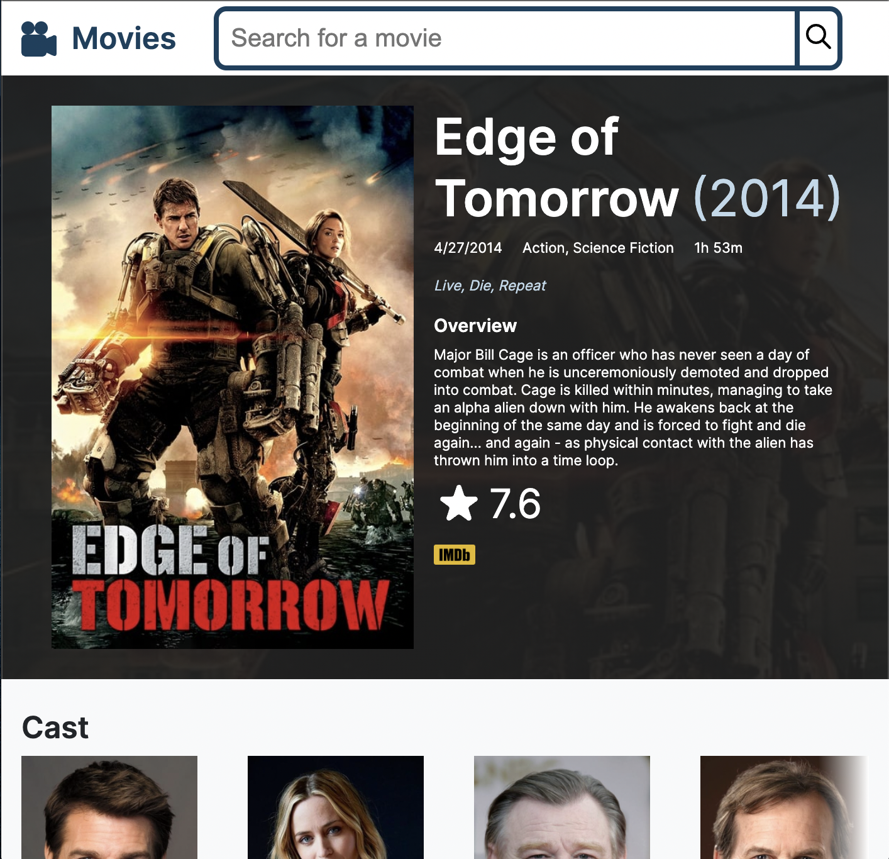

[](https://app.netlify.com/sites/neilsmovieapp/deploys)

## Movie web app

- [General info](#general-info)
- [Technologies](#technologies)
- [Setup](#setup)

## General info

This repository holds the source code for a movie web app that can display lists of movies, details of a movie, and has search.

## Technologies

Project is created with:

- [The Movie Database API](https://developers.themoviedb.org/3/getting-started/introduction)
- TypeScript: 4.5.4
- React: 17.0.2
- React Router: 5.2.0

## Setup

To run this project, you'll need to create a .env file at the root of the project and set the variable REACT_APP_TMDB_API_KEY to your TMDB api key. Install it locally using npm:

```
$ cd ./movie-app-react
$ npm install
$ npm start
```

## Demo

The live demo is deployed on Netlify: https://neilsmovieapp.netlify.com/


